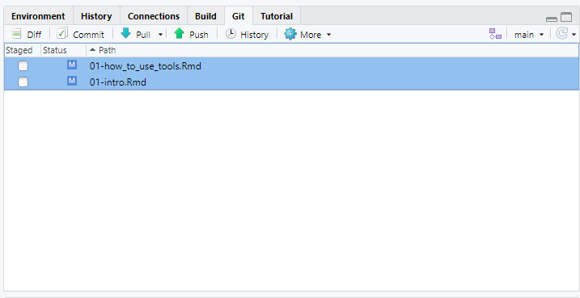

# Stat learning
{width="100%"}
Test bookdown for creating better books.
tanduc307@gmail.com

<!--chapter:end:index.Rmd-->

# How to use tools

## Tạo thư mục làm việc

Khi sử dụng Rstudio thì nên tạo thư mục project để toàn bộ files sẽ nằm trong đó.

Cách thực hiện xem ở đây <https://alexd106.github.io/intro2R/howto.html#rstudio_proj-vid>

Lợi thế là trong folder project này, ta có thể tạo các folder con như images, data, tables, ... để thuận tiện lưu riêng từng loại dữ liệu. [hiện tại làm sao để cấu hình cho hình ảnh nó tự động lưu theo từng folder thì chưa biết cách, thấy có package 'here' mà không biết cách dùng).

Lưu ý là khi dùng bookdown để render books thì tên của heading là ghi tiếng Anh cho lành, vì nếu ghi tiếng Việt thì nó render bị lỗi unicode.

<iframe src="https://player.vimeo.com/video/460932720?h=ee64dffa97" width="640" height="360" frameborder="0" allow="autoplay; fullscreen; picture-in-picture" allowfullscreen></iframe>
<p><a href="https://vimeo.com/460932720">RStudio Projects</a> from <a href="https://vimeo.com/user114793395">intro 2R</a> on <a href="https://vimeo.com">Vimeo</a>.</p>

## Chèn hình ảnh

Có các cách chèn hình khi sử dụng Rstudio như sau:

• Chuyển qua chế độ Visual rồi insert hình ảnh. Sau đó hình ảnh sẽ được lưu trong folder \_book/images khi render bằng knitr.

• Nếu gõ theo kiểu source code thì dùng đoạn mã sau
`
```
{r echo=TRUE, paged.print=FALSE, out.width="30%"}
knitr::include_graphics("images/cover.jpg")
```
`

```{r echo=TRUE, paged.print=FALSE, out.width="30%"}
knitr::include_graphics("images/cover.jpg")
```

• Nếu copy và paste từ trên Internet thì dùng add-on `imageclipr` [\<https://github.com/Toniiiio/imageclipr>](https://github.com/Toniiiio/imageclipr){.uri}. Hình ảnh sẽ lưu mặc định trong working directory.

• Nếu copy và paste hình ảnh theo kiểu thủ công thì hình ảnh mặc định sẽ lưu ở `C:/Users/tandu/AppData/Local/RStudio/tmp/paste-B717C571.png` như vậy thì khi xuất bản online sẽ không thấy. Do đó phải đưa hình ảnh vào trong thư mục project (theo kiểu thủ công) hoặc dùng add-on `imageclipr` theo kiểu trực tiếp trong Rstudio (nhưng ở dạng Rmarkdown, còn Rmarkdown visual thì bị lỗi).

## Chèn video

Sử dụng link này <https://video-to-markdown.marcomontalbano.com/> (theo kiểu click vào hình rồi direct qua source để play video)

Hoặc syntax `[]({video-url} "Link Title")`

Chèn từ Youtube, sử dụng code embed rồi paste vào.

`<iframe width="560" height="315" src="https://www.youtube.com/embed/RLxV3T2b524" title="YouTube video player" frameborder="0" allow="accelerometer; autoplay; clipboard-write; encrypted-media; gyroscope; picture-in-picture" allowfullscreen></iframe>`

Tuy nhiên video sẽ không tự động resize theo khung cửa sổ

<iframe width="560" height="315" src="https://www.youtube.com/embed/RLxV3T2b524" title="YouTube video player" frameborder="0" allow="accelerometer; autoplay; clipboard-write; encrypted-media; gyroscope; picture-in-picture" allowfullscreen></iframe>

Nên dùng code này để video tự động resize. Chiều rộng và cao 100% có nghĩa là theo khung cửa sổ chứ không phải theo kích thước gốc của video.

`<div style="position:relative;padding-bottom:56.25%;">
 <iframe style="width:100%;height:100%;position:absolute;left:0px;top:0px;"
 frameborder="0" width="100%" height="100%" 
 allowfullscreen
 src="https://www.youtube.com/embed/RLxV3T2b524">
</iframe>
</div>`

<div style="position:relative;padding-bottom:56.25%;">
 <iframe style="width:100%;height:100%;position:absolute;left:0px;top:0px;"
 frameborder="0" width="100%" height="100%" 
 allowfullscreen
 src="https://www.youtube.com/embed/RLxV3T2b524">
</iframe>
</div>

Chèn từ Github, lưu ý vị trí đường dẫn của file (kể cả trong sub folder phải chính xác) và repo phải tạo Gitpage. Video sẽ play khi mở bằng trình duyệt.

`<div style="position:relative;padding-bottom:56.25%;">
 <iframe style="width:100%;height:100%;position:absolute;left:0px;top:0px;"
 frameborder="0" width="100%" height="100%" 
 allowfullscreen
 src="https://tanduc307.github.io/xstk/images/thanks.mp4">
</iframe>
</div>`

<div style="position:relative;padding-bottom:56.25%;">
 <iframe style="width:100%;height:100%;position:absolute;left:0px;top:0px;"
 frameborder="0" width="100%" height="100%" 
 allowfullscreen
 src="https://tanduc307.github.io/xstk/images/thanks.mp4">
</iframe>
</div>

Có thể dùng package `vembedr` https://ijlyttle.github.io/vembedr/ để insert video cho nhanh.

## Văn phạm tiếng Anh

Cách sử dụng dấu ba chấm ellipses. <https://t.me/c/1605387342/140>

Cách chèn âm thanh vào theo cách upload lên github rồi play từ URL. Chưa tìm ra cách play từ source trên hard disk.

Sử dụng package `embedr` <https://github.com/mccarthy-m-g/embedr>

```{r}
library(embedr)
embed_audio(src = "https://tanduc307.github.io/light/An%20ellipsis%20(plural_%20ellipses)%20is%20a%20punctuation%20mark%20consisting%20of%20three%20dots..mp3")
```

## Trích dẫn

Xem hướng dẫn ở đây là làm được <https://inbo.github.io/tutorials/tutorials/r_citations_markdown/>

## Cú pháp Markdown

Xem ở đây <https://www.markdownguide.org/basic-syntax/>

## Setup Github cho RStudio

Mục đích là để thuận tiện lưu trữ toàn bộ dữ liệu của dự án R mà khỏi cần copy, save as thủ công. <https://intro2r.com/github_r.html>

Khi có file nào đó thay đổi thì ở Tab Git này sẽ update ngay. Ta chỉ cần chọn `Ctrl+A` rồi `Space` để select all sau đó `commit` rồi mới `push` lên server Git để lưu trữ.



## Tham khảo

<https://rstats.wtf/>

<!--chapter:end:01-how_to_use_tools.Rmd-->

